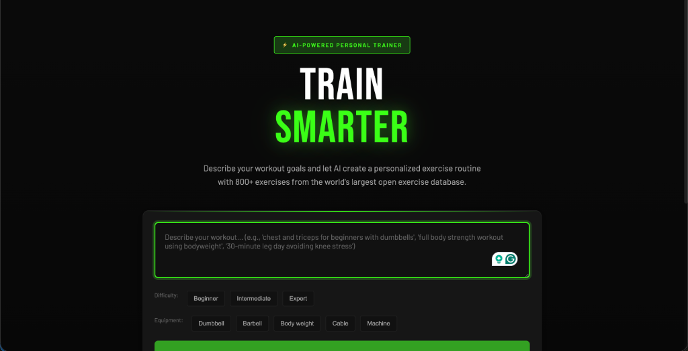

# TrainSmarter

> **Train smarter, not harder.**  
> An AI-powered personal trainer that generates personalized workout plans using RAG (Retrieval-Augmented Generation) and the world's largest open exercise database.



## ⚡ Features

-   **Personalized Workouts**: describe your goals, equipment, and constraints in natural language.
-   **AI-Powered Config**: Powered by **Claude 3.5 Sonnet** for intelligent workout structuring.
-   **Massive Database**: Access to 800+ exercises via ExerciseDB.
-   **Smart Fallbacks**: Automated YouTube tutorial integration for every exercise.
-   **Athletic Brutalism**: A high-contrast, modern UI designed for focus and clarity.

## 🛠️ Tech Stack

### Frontend
-   **React + Vite**: Blazing fast frontend.
-   **CSS Variables**: Custom "Athletic Brutalism" design system.

### Backend
-   **FastAPI**: High-performance Python backend.
-   **Anthropic API**: Advanced LLM for workout generation.
-   **ExerciseDB**: Detailed exercise metadata source.

## 🚀 Getting Started

### Prerequisites
-   Node.js 18+
-   Python 3.9+
-   Anthropic API Key
-   RapidAPI Key (ExerciseDB)

### Installation

1.  **Clone the repository**
    ```bash
    git clone https://github.com/KaavinB/trainsmarter.git
    cd trainsmarter
    ```

2.  **Setup Backend**
    ```bash
    cd backend
    python -m venv venv
    source venv/bin/activate  # On Windows: venv\Scripts\activate
    pip install -r requirements.txt
    ```
    Create a `.env` file in `backend/`:
    ```env
    ANTHROPIC_API_KEY=your_key_here
    RAPIDAPI_KEY=your_key_here
    ```

3.  **Setup Frontend**
    ```bash
    # Open a new terminal
    cd ..  # Back to root
    npm install
    ```

4.  **Run the App**
    ```bash
    # Terminal 1 (Backend)
    cd backend
    python main.py

    # Terminal 2 (Frontend)
    npm run dev
    ```

## 📄 License

MIT © [KaavinB](https://github.com/KaavinB)
